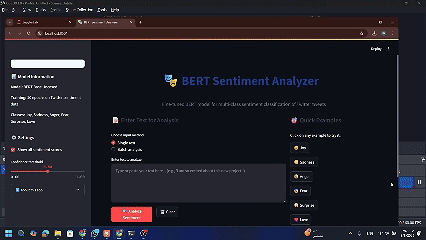

# BERT-Powered Multi-Class Emotion Detection System 🤖💬

[](https://python.org)
[](https://pytorch.org)
[](https://huggingface.co/transformers)
[](LICENSE)

## 🎯 Overview

A state-of-the-art emotion detection system built with BERT (Bidirectional Encoder Representations from Transformers) that can classify text into 6 distinct emotional categories: **Joy**, **Sadness**, **Anger**, **Fear**, **Love**, and **Surprise**. This project demonstrates advanced NLP techniques and achieves **90.9% accuracy** on multi-class emotion classification.

## 🌟 Key Features

- **High Performance**: Achieves 90.9% accuracy with weighted F1-score of 0.91
- **Multi-Class Classification**: Detects 6 different emotions from text
- **Pre-trained BERT**: Leverages bert-base-uncased for superior language understanding
- **Production Ready**: Includes prediction pipeline for real-world deployment
- **Comprehensive Evaluation**: Detailed metrics and classification reports
- **Easy Integration**: Simple API for seamless integration into applications

## 🚀 Demo



*Real-time emotion detection in action*

## 📊 Model Performance

| Emotion | Precision | Recall | F1-Score | Support |
|---------|-----------|--------|----------|---------|
| Anger   | 0.77      | 0.81   | 0.79     | 261     |
| Fear    | 0.93      | 0.89   | 0.91     | 432     |
| Joy     | 0.94      | 0.96   | 0.95     | 933     |
| Love    | 0.85      | 0.93   | 0.89     | 387     |
| Sadness | 0.94      | 0.92   | 0.93     | 1072    |
| Surprise| 0.84      | 0.66   | 0.74     | 115     |

**Overall Accuracy: 90.9%** | **Weighted F1-Score: 0.91**

## 🛠️ Installation

### Prerequisites
- Python 3.8+
- CUDA-capable GPU (recommended)

### Quick Setup

```bash
# Clone the repository
git clone https://github.com/mustafasamy28/bert-emotion-detection-system.git
cd bert-emotion-detection-system

# Install dependencies
pip install -r requirements.txt
```

### Required Packages
```
torch>=2.0.0
transformers>=4.30.0
datasets>=2.12.0
scikit-learn>=1.3.0
pandas>=2.0.0
numpy>=1.24.0
evaluate>=0.4.0
accelerate>=0.20.0
seaborn>=0.12.0
```

## 📁 Project Structure

```
bert-emotion-detection-system/
├── 📁 bert-base-uncased-sentiment-model/    # Trained model files
├── 📁 bert_base_train_dir/                  # Training artifacts
├── 📁 Demo/                                 # Demo files and GIFs
├── 📁 .ipynb_checkpoints/                   # Jupyter checkpoints
├── 📄 Fine_Tuning_BERT_for_Multi_Class_Sentiment_Analysis.ipynb
├── 📄 app.py                                # Main application
├── 📄 config                                # Configuration files
├── 📄 requirements.txt                      # Dependencies
├── 📄 README.md                             # Project documentation
└── 📄 LICENSE                               # License file
```

## 🚀 Quick Start

### 1. Training the Model

```python
from transformers import AutoTokenizer, AutoModelForSequenceClassification, pipeline

# Load the trained model
classifier = pipeline('text-classification', 
                     model='./bert-base-uncased-sentiment-model')

# Make predictions
results = classifier([
    "I am super happy today!",
    "This makes me so angry",
    "I'm feeling a bit scared",
    "I love this amazing project!"
])

print(results)
```

### 2. Using the Prediction Function

```python
def get_prediction(text):
    """Get emotion prediction for input text"""
    input_encoded = tokenizer(text, return_tensors='pt').to(device)
    
    with torch.no_grad():
        outputs = model(**input_encoded)
    
    logits = outputs.logits
    pred = torch.argmax(logits, dim=1).item()
    
    return id2label[pred]

# Example usage
emotion = get_prediction("I am absolutely thrilled!")
print(f"Detected emotion: {emotion}")
```

## 📈 Dataset Information

- **Source**: Twitter Multi-Class Sentiment Dataset
- **Total Samples**: 16,000 tweets
- **Classes**: 6 emotions (Joy, Sadness, Anger, Fear, Love, Surprise)
- **Split**: 70% Train, 20% Test, 10% Validation
- **Preprocessing**: Tokenization with BERT tokenizer, padding and truncation

### Class Distribution
- Joy: 5,362 samples (33.5%)
- Sadness: 4,666 samples (29.2%)
- Anger: 2,159 samples (13.5%)
- Fear: 1,937 samples (12.1%)
- Love: 1,304 samples (8.2%)
- Surprise: 572 samples (3.6%)

## 🔧 Training Configuration

- **Model**: bert-base-uncased
- **Epochs**: 2
- **Batch Size**: 64
- **Learning Rate**: 2e-5
- **Weight Decay**: 0.01
- **Optimizer**: AdamW
- **Hardware**: CUDA-enabled GPU

## 🎯 Use Cases

- **Social Media Monitoring**: Analyze customer sentiment on social platforms
- **Customer Support**: Automatically categorize support tickets by emotion
- **Content Moderation**: Detect and filter emotionally charged content
- **Market Research**: Understand emotional responses to products/services
- **Mental Health Applications**: Monitor emotional well-being through text analysis
- **Chatbot Enhancement**: Make conversational AI more emotionally aware

## 🚀 Deployment Options

### Local Deployment
```bash
streamlit run app.py
```

### API Integration
The model can be easily integrated into REST APIs, web applications, or microservices architecture.

### Cloud Deployment
Compatible with major cloud platforms:
- AWS SageMaker
- Google Cloud AI Platform
- Azure Machine Learning
- Hugging Face Spaces

## 🤝 Contributing

Contributions are welcome! Please feel free to submit a Pull Request. For major changes, please open an issue first to discuss what you would like to change.

1. Fork the Project
2. Create your Feature Branch (`git checkout -b feature/AmazingFeature`)
3. Commit your Changes (`git commit -m 'Add some AmazingFeature'`)
4. Push to the Branch (`git push origin feature/AmazingFeature`)
5. Open a Pull Request

## 📫 Contact

**Mostafa Samy** - AI/ML Engineer & Chatbot Developer

- 📧 Email: [mustafasamy28@gmail.com](mailto:mustafasamy28@gmail.com)
- 💼 LinkedIn: [Mostafa Samy](https://www.linkedin.com/in/mostafa-samy-9b95711a7/)
- 🐙 GitHub: [@mustafasamy28](https://github.com/mustafasamy28)

## 📄 License

This project is licensed under the MIT License - see the [LICENSE](LICENSE) file for details.

## 🙏 Acknowledgments

- Hugging Face for the amazing Transformers library
- The creators of the Twitter Multi-Class Sentiment dataset
- PyTorch team for the deep learning framework
- BERT authors for the revolutionary language model

## ⭐ Show Your Support

If this project helped you, please give it a ⭐ on GitHub and share it with others!

---

*Built with ❤️ by Mostafa Samy - Transforming text into emotional intelligence*
